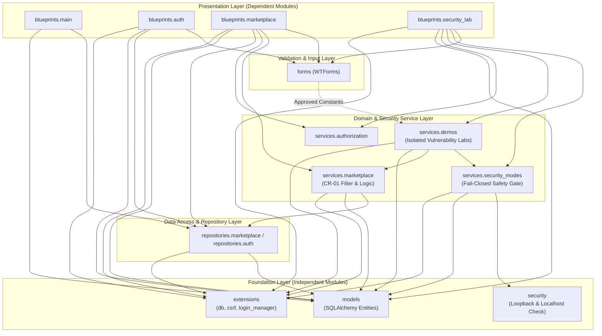

# SecureHire Internal Module Dependency Analysis

## 1. Overview and Architectural Context

The **SecureHire** academic web application is structured around a layered, modular Flask architecture. The system intentionally separates presentation, domain business rules, persistence, and educational security laboratory demonstrations.

This document details the internal dependency graph, categorizes modules by coupling and stability, measures incoming and outgoing dependencies, verifies the absence of dependency cycles, and presents a complete Mermaid architectural diagram.

---

## 2. Definitions: Dependent vs. Independent Modules

To provide academic rigor, we distinguish between **internal dependencies** (coupling between SecureHire components) and **external dependencies** (frameworks and third-party libraries such as Flask, SQLAlchemy, WTForms):

- **Dependent Module (High Coupling / Orchestrator)**:
  A module that imports or relies on multiple internal modules to perform its duties. Changes in underlying domain models, repositories, or services directly impact dependent modules. In SecureHire, Blueprints and Web Routes are prime examples of dependent modules.
- **Relatively Independent Module (Low Coupling / Foundation)**:
  A module with zero or minimal internal dependencies that provides fundamental abstractions, models, or utilities. It performs a tightly scoped single responsibility without knowing about or relying on higher-level orchestrators. In SecureHire, `app.models`, `app.security`, and `app.extensions` represent independent foundation modules.

---

## 3. Internal Module Inventory & Coupling Metrics

| Module / Package | Primary Purpose | Internal Dependencies (Outgoing) | Incoming Dependents | Outgoing Count | Incoming Count | Coupling Category |
| :--- | :--- | :--- | :--- | :---: | :---: | :--- |
| **`app.security`** | Pure network locality & host validation utilities (`is_loopback_address`, `is_allowed_local_host`). | *None* | `app.services.security_modes`, `app.__init__` | 0 | 2 | **Independent / Low-Coupling** |
| **`app.models`** | Declarative SQLAlchemy database models (`User`, `Profile`, `Gig`, `Proposal`, `Review`, `LabRun`, etc.). | *None* | `app.blueprints.*`, `app.repositories`, `app.services.*`, `app.extensions` | 0 | 9 | **Independent / Low-Coupling** (Foundation) |
| **`app.extensions`** | Extension singletons (`db`, `login_manager`, `csrf`). | *None* | `app`, `app.blueprints.*`, `app.repositories`, `app.services.*` | 0 | 8 | **Independent / Low-Coupling** (Foundation) |
| **`app.services.authorization`** | Role-based authorization decorators (`@roles_required`). | *None* | `app.blueprints.marketplace`, `app.blueprints.security_lab` | 0 | 2 | **Independent / Low-Coupling** (Cross-Cutting) |
| **`app.repositories`** | Data access abstraction and parameterized database queries (`marketplace.py`, `auth.py`). | `app.extensions`, `app.models` | `app.blueprints.auth`, `app.blueprints.main`, `app.blueprints.marketplace`, `app.services.marketplace` | 2 | 4 | **Low-Coupling** (Data Layer) |
| **`app.forms`** | WTForms form definitions, input validators, and CSRF token handling. | `app.services.demos` (safe constants only) | `app.blueprints.auth`, `app.blueprints.marketplace`, `app.blueprints.security_lab` | 1 | 3 | **Low-Coupling** (Validation Layer) |
| **`app.services.security_modes`** | Central fail-closed safety gate, lab mode resolution, audit logging. | `app.extensions`, `app.models`, `app.security` | `app.blueprints.security_lab`, `app.services.demos` | 3 | 2 | **Medium-Coupling** (Security Core) |
| **`app.services.marketplace`** | Marketplace domain operations, transactional state transitions, filter criteria validation (`CR-01`). | `app.extensions`, `app.models`, `app.repositories` | `app.blueprints.marketplace`, `app.services.demos` | 3 | 2 | **Medium-Coupling** (Domain Service) |
| **`app.services.demos`** | Isolated vulnerable and mitigated educational security demonstrators. | `app.extensions`, `app.models`, `app.services.marketplace`, `app.services.security_modes` | `app.blueprints.security_lab`, `app.forms` | 4 | 2 | **Medium-Coupling** (Educational Lab) |
| **`app.blueprints.main`** | Landing page, navigation, static informational routes. | `app.models`, `app.repositories` | *None* | 2 | 0 | **Dependent** (Presentation) |
| **`app.blueprints.auth`** | Authentication routes: login, registration, logout, profile management. | `app.extensions`, `app.forms`, `app.models`, `app.repositories` | *None* | 4 | 0 | **Dependent** (Presentation) |
| **`app.blueprints.marketplace`** | Marketplace browsing, gig lifecycle, proposals, reviews, CR-01 filter orchestration. | `app.extensions`, `app.forms`, `app.models`, `app.repositories`, `app.services.authorization`, `app.services.marketplace` | *None* | 6 | 0 | **Dependent** (Presentation) |
| **`app.blueprints.security_lab`** | Security Lab admin console, mode switcher, vulnerable & mitigated demo execution. | `app.extensions`, `app.forms`, `app.models`, `app.services.authorization`, `app.services.demos`, `app.services.security_modes` | *None* | 6 | 0 | **Dependent** (Presentation) |

---

## 4. Architectural Analysis & Dependency Directions

### 4.1 Unidirectional Dependency Flow
The application strictly enforces a top-to-bottom dependency hierarchy:
1. **Presentation Tier (Blueprints & Routes)** depends upon Services, Forms, and Repositories.
2. **Business & Security Logic Tier (Services)** depends upon Repositories, Security Modes, and Models.
3. **Data Access Tier (Repositories)** depends strictly on Models and Extension singletons.
4. **Foundation Tier (Models, Extensions, Network Security Utilities)** has zero internal dependencies.

### 4.2 Cycle Detection
AST graph traversal confirms that the internal dependency graph is a **Directed Acyclic Graph (DAG)**:
- **Cycles Detected**: **0**
- No circular imports exist between models, repositories, and services.
- Presentation layers never import from blueprints; blueprints never import each other.

---

## 5. Architectural Mermaid Diagram

---

## 6. Key Architectural Observations

1. **Isolation of Educational Vulnerabilities**:
   Vulnerability demonstrations in `app.services.demos` are strictly isolated from normal marketplace operations. They communicate with the application solely through bounded fixture models (`LabGigFixture`) and are subject to the fail-closed loopback safety gate in `app.services.security_modes`.
2. **Clean Separation of Concerns**:
   Database query construction is contained within `app.repositories` and `app.services.marketplace`. Blueprints do not write raw SQL or complex queries, adhering to clean architecture principles.
3. **High Cohesion and Low Coupling**:
   Independent utility modules (`app.security`, `app.services.authorization`) have single, unambiguous responsibilities and zero internal dependencies, facilitating high unit-test coverage without requiring database setup.
